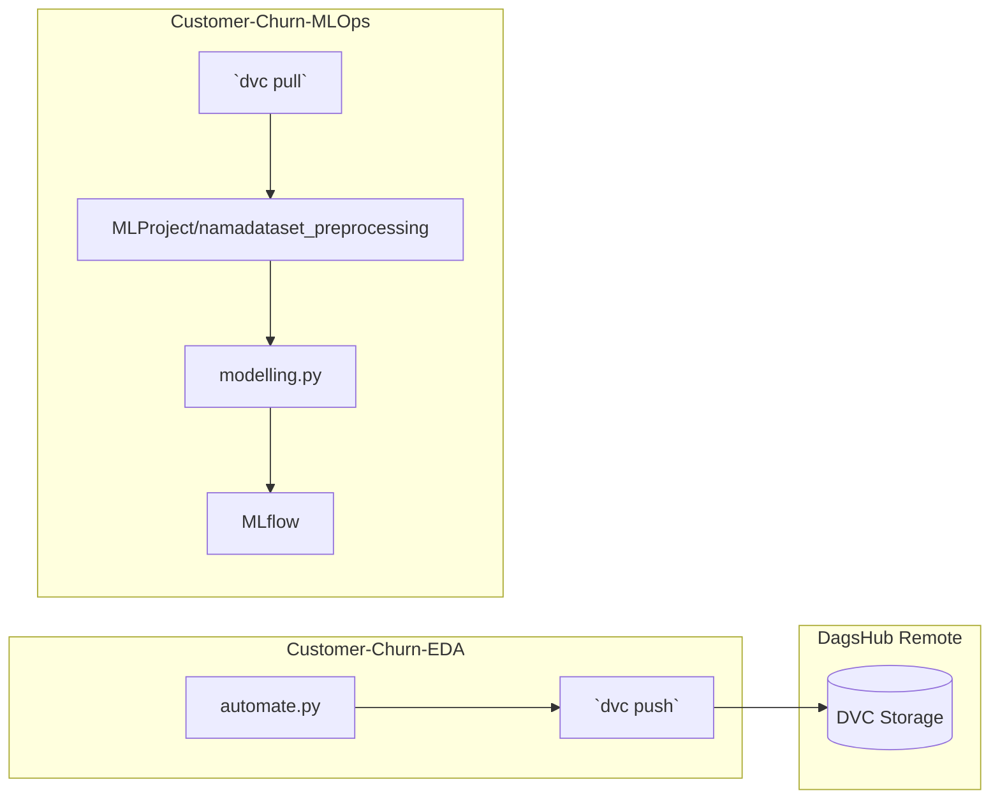

# 📦 Customer-Churn-MLOps – Kriteria 3 (CI & Deployment)

## 📁 Folder Structure
```
Customer-Churn-MLOps/
├── Dockerfile                # Container image for model serving
├── MLProject/
│   ├── mlproject.yaml        # MLflow Project definition
│   ├── params.yaml           # Default parameters
│   └── requirements.txt      # Python dependencies for training
├── .github/workflows/ci.yml  # GitHub Actions CI pipeline
├── README.md                 # *You are reading it*
└── requirements.txt          # Top‑level dependencies (Docker, CI)
```

## 🛠️ Core Components
- **MLProject** – Standardised entry point for training (`mlflow run MLProject`).
- **Dockerfile** – Builds a reproducible image that runs `Inference.py` (served from `SMSML_Rois-Hoiron/Monitoring dan Logging`).
- **GitHub Actions (`ci.yml`)** – Executes the MLflow run, runs linting, and verifies that the model artifacts are produced.

## 🚀 How to Use
1. **Clone repository**
```bash
git clone https://github.com/roiskhoiron/Customer-Churn-MLOps.git
cd Customer-Churn-MLOps
```
2. **Install dependencies** (for local CI testing)
```bash
pip install -r requirements.txt
```
3. **Run CI locally** (optional)
```bash
bash -c "mlflow run MLProject --env-manager=local"
```
4. **Build Docker image**
```bash
docker build -t churn‑service .
```
5. **Run container** (serves API from `../SMSML_Rois-Hoiron/Monitoring dan Logging/Inference.py`)
```bash
docker run -p 8000:8000 churn‑service
```

## 📊 What This Folder Provides for Kriteria 3
- **MLProject** – standardisation of training commands.
- **CI pipeline** – automatically validates code, runs training, and publishes artefacts.
- **Docker** – ensures reproducible deployment for the serving component.

---

## 📦 Data Versioning dengan DVC

### 🎯 Tujuan
Data preprocessing dihasilkan oleh **Customer‑Churn‑EDA** dan dibagikan ke repositori ini melalui **DVC** + **DagsHub** sebagai remote storage. Repositori ini hanya bertindak sebagai **konsumen data** — menarik versi terbaru untuk pelatihan model.

### 🔁 Alur Data dari EDA ke MLOps



### 🛠️ Bagi DevOps / CI Engineer

**Lokal — mengambil data preprocessing:**

```bash
export DAGSHUB_TOKEN=72ea8c5251856c29972ca84a12ff422323986208
dvc remote modify dagshub password $DAGSHUB_TOKEN
dvc pull
```

Setelah itu folder `MLProject/namadataset_preprocessing/` akan berisi:
- `X_train.csv`, `X_test.csv`, `y_train.csv`, `y_test.csv`, `scaler.pkl`

**CI Pipeline (GitHub Actions):**

```yaml
# .github/workflows/ci.yml (langkah DVC sudah terintegrasi)
- name: DVC pull data
  env:
    DAGSHUB_TOKEN: ${{ secrets.DAGSHUB_TOKEN }}
  run: |
    dvc remote modify dagshub password $DAGSHUB_TOKEN
    dvc pull
- name: Run MLflow project
  run: mlflow run MLProject --env-manager=local
```

### ⚙️ Cara Kerja Otonom

1. **EDA CI** menjalankan preprocessing → `dvc add` → `dvc push` ke DagsHub.
2. **MLOps CI** dipicu (bisa via `workflow_dispatch` atau push ke repo ini) → `dvc pull` → `mlflow run MLProject`.
3. Tidak ada data CSV yang di‑commit ke Git — hanya metadata `.dvc` yang versi‑able.
4. DVC memastikan data selalu sinkron antara kedua repositori tanpa perlu salinan manual.

---
**Proyek SMSML Dicoding Indonesia 2026**  
**Student:** Roishoiron